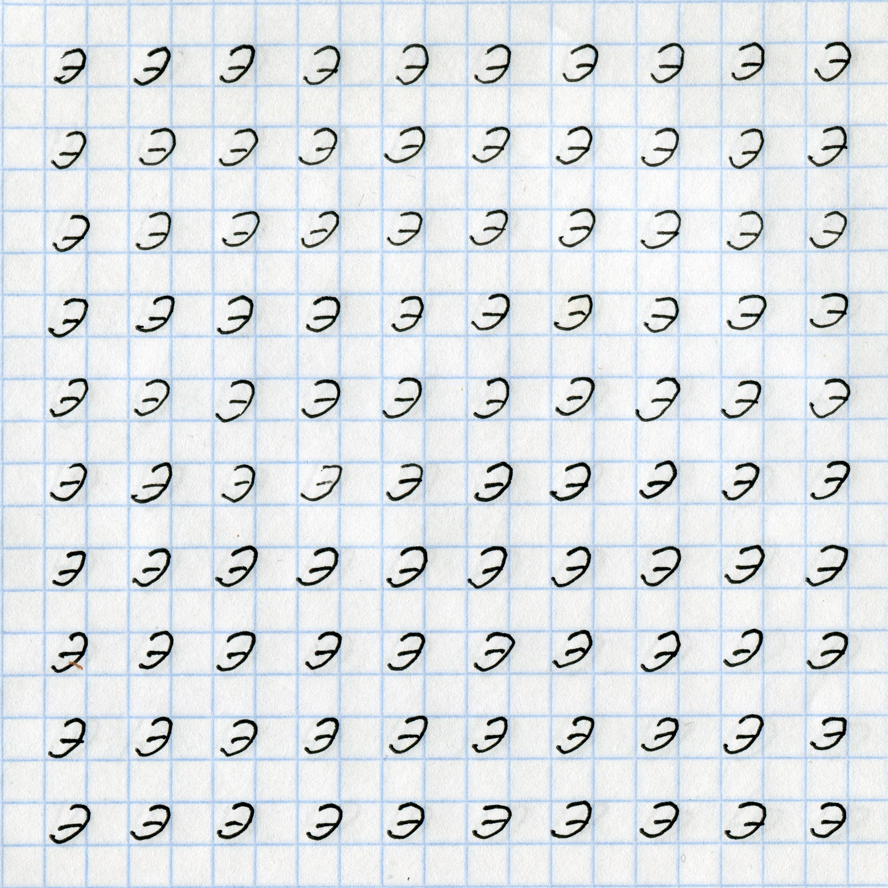
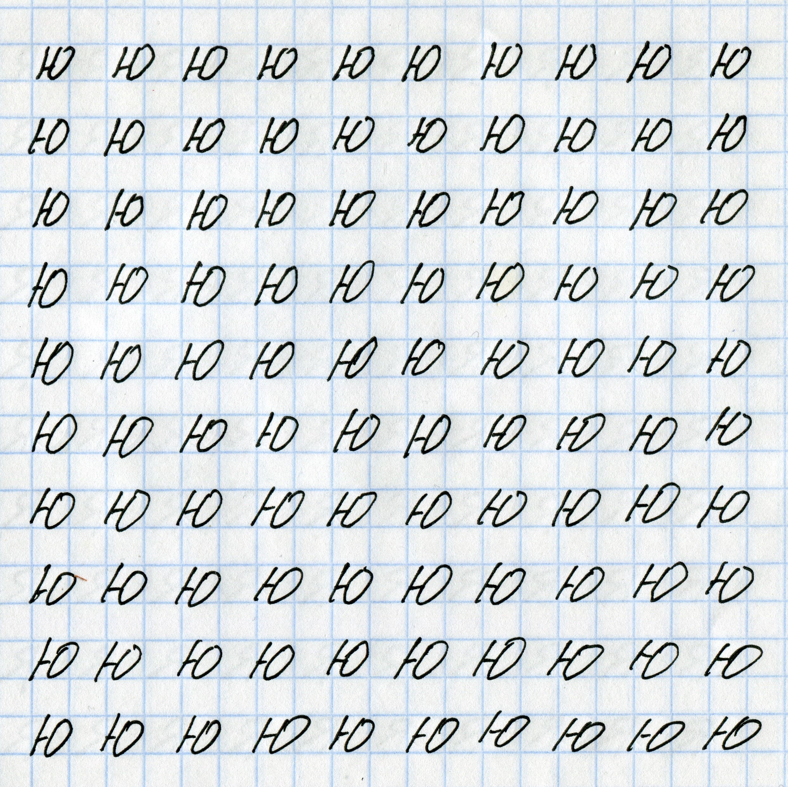
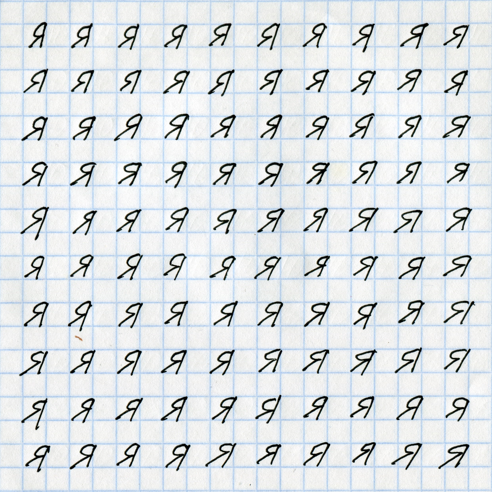
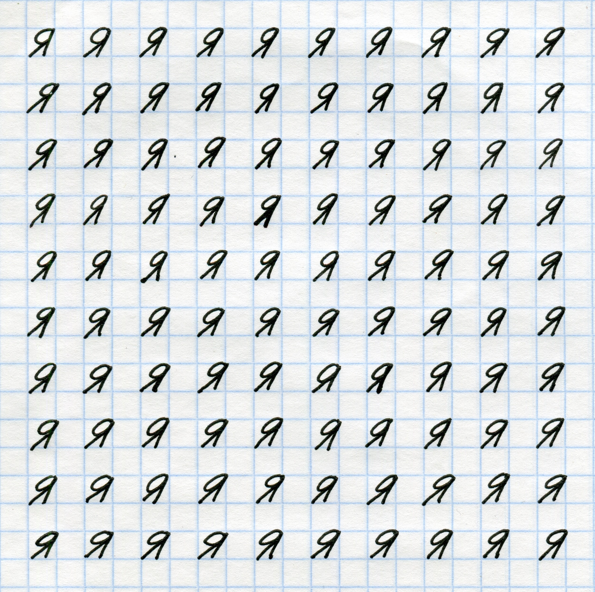

# Отчет по лабораторной работе 
## по курсу "Искусственый интеллект"

## Нейросетям для распознавания изображений


### Студенты: 

| ФИО       | Роль в проекте                     | Оценка       |
|-----------|------------------------------------|--------------|
| Введенская Полина | Подготовка датасета, обучение нейросети, написание отчета |          |

## Результат проверки

| Преподаватель     | Дата         |  Оценка       |
|-------------------|--------------|---------------|
| Сошников Д.В. |              |               |

> *Комментарии проверяющих (обратите внимание, что более подробные комментарии возможны непосредственно в репозитории по тексту программы)*

## Тема работы

Введенская -> 194 % 5 + 1 = 5

5. Буквы Э, Ю, Я.

## Распределение работы в команде

Введенская Полина - подготовка датасета, обучение нейросети, написание отчета

## Подготовка данных

Тетрадный лист бумаги, содержащий символы, отсканирован в высоком разрешении и обработан в графическом редакторе SAI. Повышение контрастности изображения и преобразование в ЧБ позволило полностью убрать фон с тетрадной клеткой без значительной потери качества самих символов. В том же редакторе сканы обрезаны и уменьшены до размера 320x320. Отдельные символы вырезаны с помощью скрипта [image-slicer](https://pypi.org/project/image-slicer/).

Несмотря на значительную нехватку участников для полноценного выполнения задания, датасет состоит из нескольких частей благодаря помощи моей младшей сестры.

 
 
 

Ссылка на получившийся датасет:  
Э - https://drive.google.com/open?id=1_ALHsXhYGMH_1aX1g796iQoG8kq5rMt5  
Ю - https://drive.google.com/open?id=1lVt_rQr9Am_f_Rof5SH9okdc-a_xTA9R  
Я - https://drive.google.com/open?id=1adNm-pxU-A6OXjCZEKbXCOBsJRveRMbt  

## Загрузка данных

Изображения считываются из соответствующих папок и записываются в матрицу. После этого матрица и вектор классов преобразуются в массивы numpy. Датасет делится на обучающий и тестовый набор, в данном случае в пропорции 80/20. 

```
symbols = ['e', 'u', 'y']
classes = []
data = []

for symbol in symbols:
    for image in os.listdir(symbol):
        array = cv2.imread(symbol + '/' + image, 0)
        data.append(array)
        if symbol == 'e':
            classes.append(0)
        elif symbol == 'u':
            classes.append(1)
        elif symbol == 'y':
            classes.append(2)

arr_classes = np.array(classes)
arr_data = np.array(data)
```

Используя Theano, необходимо объявить глубину обрабатываемого изображения: к примеру, полноцветное изображение с тремя каналами RGB обладает глубиной 3. В данном случае глубина всего 1. Зная параметры изображения (32, 32, 1), мы трансформируем изображения в одномерный массив с помощью функции reshape.

Последний шаг: конвертирование типа данных в float32 и нормализация значения интенсивности к интервалу [0, 1].

```
# 80 / 20 split
num_train = 480 
num_test = 120
num_classes = 3
height, width, depth = 32, 32, 1

x_train, x_test, y_train, y_test = train_test_split(arr_data, arr_classes, test_size = 0.2)

x_train = x_train.reshape(num_train, height * width)
x_test = x_test.reshape(num_test, height * width)
x_train = x_train.astype('float32')
x_test = x_test.astype('float32')
x_train /= 255 
x_test /= 255

y_train = np_utils.to_categorical(y_train, num_classes) 
y_test = np_utils.to_categorical(y_test, num_classes)
```

## Обучение нейросети

### Полносвязная однослойная сеть
**Архитектура**

Объявление модели:
```
m_in = Input(shape = (height * width,))
m_out = Dense(num_classes, activation='softmax')(m_in)
model = Model(inputs=m_in, outputs=m_out)
```
m_in и m_out возвращают тензоры, с помощью которых объявляется модель типа Model.

Компиляция модели:
```
model.compile(loss='categorical_crossentropy',
	optimizer='adam', 
	metrics=['accuracy'])
```
Keras предлагает пользователю множество различных функций потерь и алгоритмов оптимизации. Я выбрала категориальную кросс-энтропию и алгоритм adam, потому что они используются в обучающем примере, на который я опиралась в данной работе.

Обучение и оценка модели, вывод результата:
```
model.summary()
model.fit(x_train, y_train, 
          batch_size=32, epochs=50, 
          verbose=1, validation_split=0.1)
loss, accuracy = model.evaluate(x_test, y_test, verbose=1)
print('Loss = {}, Accuracy = {}'.format(loss, accuracy))
```

**Результаты**

```
_________________________________________________________________
Layer (type)                 Output Shape              Param #   
=================================================================
input_1 (InputLayer)         (None, 1024)              0         
_________________________________________________________________
dense_1 (Dense)              (None, 3)                 3075      
=================================================================
Total params: 3,075
Trainable params: 3,075
Non-trainable params: 0
_________________________________________________________________
Train on 432 samples, validate on 48 samples
Epoch 1/50
432/432 [==============================] - 0s 43us/step - loss: 0.0617 - acc: 0.9931 - val_loss: 0.1150 - val_acc: 0.9792
Epoch 2/50
432/432 [==============================] - 0s 43us/step - loss: 0.0607 - acc: 0.9931 - val_loss: 0.1507 - val_acc: 0.9583
Epoch 3/50
432/432 [==============================] - 0s 53us/step - loss: 0.0575 - acc: 0.9977 - val_loss: 0.1090 - val_acc: 0.9792
Epoch 4/50
432/432 [==============================] - 0s 54us/step - loss: 0.0529 - acc: 0.9954 - val_loss: 0.1211 - val_acc: 0.9792
Epoch 5/50
432/432 [==============================] - 0s 34us/step - loss: 0.0557 - acc: 0.9954 - val_loss: 0.1149 - val_acc: 0.9792
Epoch 6/50
432/432 [==============================] - 0s 32us/step - loss: 0.0525 - acc: 0.9977 - val_loss: 0.1061 - val_acc: 0.9792
Epoch 7/50
432/432 [==============================] - 0s 37us/step - loss: 0.0507 - acc: 0.9977 - val_loss: 0.1061 - val_acc: 0.9792
Epoch 8/50
432/432 [==============================] - 0s 42us/step - loss: 0.0576 - acc: 0.9954 - val_loss: 0.1217 - val_acc: 0.9583
Epoch 9/50
432/432 [==============================] - 0s 47us/step - loss: 0.0502 - acc: 0.9954 - val_loss: 0.1030 - val_acc: 0.9792
Epoch 10/50
432/432 [==============================] - 0s 38us/step - loss: 0.0504 - acc: 0.9977 - val_loss: 0.1116 - val_acc: 0.9792
Epoch 11/50
432/432 [==============================] - 0s 36us/step - loss: 0.0510 - acc: 0.9954 - val_loss: 0.1196 - val_acc: 0.9792
Epoch 12/50
432/432 [==============================] - 0s 36us/step - loss: 0.0487 - acc: 0.9954 - val_loss: 0.1072 - val_acc: 0.9792
Epoch 13/50
432/432 [==============================] - 0s 52us/step - loss: 0.0473 - acc: 0.9977 - val_loss: 0.1107 - val_acc: 0.9792
Epoch 14/50
432/432 [==============================] - 0s 39us/step - loss: 0.0501 - acc: 0.9954 - val_loss: 0.1161 - val_acc: 0.9792
Epoch 15/50
432/432 [==============================] - 0s 39us/step - loss: 0.0483 - acc: 0.9977 - val_loss: 0.0997 - val_acc: 0.9792
Epoch 16/50
432/432 [==============================] - 0s 37us/step - loss: 0.0460 - acc: 0.9977 - val_loss: 0.1172 - val_acc: 0.9792
Epoch 17/50
432/432 [==============================] - 0s 42us/step - loss: 0.0464 - acc: 0.9977 - val_loss: 0.1119 - val_acc: 0.9792
Epoch 18/50
432/432 [==============================] - 0s 38us/step - loss: 0.0450 - acc: 0.9977 - val_loss: 0.0943 - val_acc: 0.9792
Epoch 19/50
432/432 [==============================] - 0s 46us/step - loss: 0.0473 - acc: 0.9954 - val_loss: 0.1123 - val_acc: 0.9792
Epoch 20/50
432/432 [==============================] - 0s 44us/step - loss: 0.0457 - acc: 0.9977 - val_loss: 0.0934 - val_acc: 0.9792
Epoch 21/50
432/432 [==============================] - 0s 37us/step - loss: 0.0436 - acc: 0.9977 - val_loss: 0.1069 - val_acc: 0.9792
Epoch 22/50
432/432 [==============================] - 0s 42us/step - loss: 0.0424 - acc: 0.9977 - val_loss: 0.1046 - val_acc: 0.9792
Epoch 23/50
432/432 [==============================] - 0s 31us/step - loss: 0.0429 - acc: 0.9977 - val_loss: 0.0936 - val_acc: 0.9792
Epoch 24/50
432/432 [==============================] - 0s 37us/step - loss: 0.0419 - acc: 0.9977 - val_loss: 0.1040 - val_acc: 0.9792
Epoch 25/50
432/432 [==============================] - 0s 34us/step - loss: 0.0409 - acc: 0.9977 - val_loss: 0.0962 - val_acc: 0.9792
Epoch 26/50
432/432 [==============================] - 0s 46us/step - loss: 0.0400 - acc: 0.9977 - val_loss: 0.1110 - val_acc: 0.9792
Epoch 27/50
432/432 [==============================] - 0s 37us/step - loss: 0.0409 - acc: 0.9977 - val_loss: 0.1060 - val_acc: 0.9792
Epoch 28/50
432/432 [==============================] - 0s 37us/step - loss: 0.0398 - acc: 0.9977 - val_loss: 0.0967 - val_acc: 0.9792
Epoch 29/50
432/432 [==============================] - 0s 31us/step - loss: 0.0440 - acc: 1.0000 - val_loss: 0.1199 - val_acc: 0.9583
Epoch 30/50
432/432 [==============================] - 0s 46us/step - loss: 0.0419 - acc: 1.0000 - val_loss: 0.1090 - val_acc: 0.9792
Epoch 31/50
432/432 [==============================] - 0s 42us/step - loss: 0.0451 - acc: 0.9977 - val_loss: 0.1038 - val_acc: 0.9792
Epoch 32/50
432/432 [==============================] - 0s 45us/step - loss: 0.0373 - acc: 1.0000 - val_loss: 0.0994 - val_acc: 0.9792
Epoch 33/50
432/432 [==============================] - 0s 35us/step - loss: 0.0374 - acc: 0.9977 - val_loss: 0.0910 - val_acc: 0.9792
Epoch 34/50
432/432 [==============================] - 0s 36us/step - loss: 0.0372 - acc: 1.0000 - val_loss: 0.1234 - val_acc: 0.9583
Epoch 35/50
432/432 [==============================] - 0s 34us/step - loss: 0.0407 - acc: 0.9977 - val_loss: 0.0943 - val_acc: 0.9792
Epoch 36/50
432/432 [==============================] - 0s 35us/step - loss: 0.0378 - acc: 0.9977 - val_loss: 0.0880 - val_acc: 0.9792
Epoch 37/50
432/432 [==============================] - 0s 37us/step - loss: 0.0415 - acc: 0.9977 - val_loss: 0.0923 - val_acc: 0.9792
Epoch 38/50
432/432 [==============================] - 0s 45us/step - loss: 0.0383 - acc: 1.0000 - val_loss: 0.0928 - val_acc: 0.9792
Epoch 39/50
432/432 [==============================] - 0s 37us/step - loss: 0.0353 - acc: 1.0000 - val_loss: 0.0899 - val_acc: 0.9792
Epoch 40/50
432/432 [==============================] - 0s 32us/step - loss: 0.0356 - acc: 0.9977 - val_loss: 0.0921 - val_acc: 0.9792
Epoch 41/50
432/432 [==============================] - 0s 37us/step - loss: 0.0340 - acc: 1.0000 - val_loss: 0.1057 - val_acc: 0.9792
Epoch 42/50
432/432 [==============================] - 0s 50us/step - loss: 0.0355 - acc: 1.0000 - val_loss: 0.1001 - val_acc: 0.9792
Epoch 43/50
432/432 [==============================] - 0s 37us/step - loss: 0.0370 - acc: 1.0000 - val_loss: 0.0855 - val_acc: 0.9792
Epoch 44/50
432/432 [==============================] - 0s 45us/step - loss: 0.0356 - acc: 0.9977 - val_loss: 0.0936 - val_acc: 0.9792
Epoch 45/50
432/432 [==============================] - 0s 44us/step - loss: 0.0361 - acc: 1.0000 - val_loss: 0.1061 - val_acc: 0.9792
Epoch 46/50
432/432 [==============================] - 0s 49us/step - loss: 0.0359 - acc: 1.0000 - val_loss: 0.1009 - val_acc: 0.9792
Epoch 47/50
432/432 [==============================] - 0s 42us/step - loss: 0.0398 - acc: 1.0000 - val_loss: 0.1239 - val_acc: 0.9583
Epoch 48/50
432/432 [==============================] - 0s 35us/step - loss: 0.0380 - acc: 1.0000 - val_loss: 0.0852 - val_acc: 0.9792
Epoch 49/50
432/432 [==============================] - 0s 36us/step - loss: 0.0334 - acc: 1.0000 - val_loss: 0.0842 - val_acc: 0.9792
Epoch 50/50
432/432 [==============================] - 0s 37us/step - loss: 0.0314 - acc: 1.0000 - val_loss: 0.0911 - val_acc: 0.9792
120/120 [==============================] - 0s 49us/step
Loss = 0.0909841805696, Accuracy = 0.958333337307
```

### Полносвязная многослойная сеть
**Архитектура**

Объявление модели:
```
m_in = Input(shape = (height * width,))
hidden_1 = Dense(10, activation='relu')(m_in) 
hidden_2 = Dense(10, activation='relu')(hidden_1)
m_out = Dense(num_classes, activation='softmax')(hidden_2)
model = Model(inputs=m_in, outputs=m_out)
```

Компиляция модели:
```
model.compile(loss='categorical_crossentropy',
	optimizer='adam', 
	metrics=['accuracy'])
```

Обучение и оценка модели, вывод результата:
```
model.summary()
model.fit(x_train, y_train, 
          batch_size=32, epochs=50, 
          verbose=1, validation_split=0.1)
loss, accuracy = model.evaluate(x_test, y_test, verbose=1)
print('Loss = {}, Accuracy = {}'.format(loss, accuracy))
```

**Результаты**

```
_________________________________________________________________
Layer (type)                 Output Shape              Param #   
=================================================================
input_2 (InputLayer)         (None, 1024)              0         
_________________________________________________________________
dense_2 (Dense)              (None, 10)                10250     
_________________________________________________________________
dense_3 (Dense)              (None, 10)                110       
_________________________________________________________________
dense_4 (Dense)              (None, 3)                 33        
=================================================================
Total params: 10,393
Trainable params: 10,393
Non-trainable params: 0
_________________________________________________________________
Train on 432 samples, validate on 48 samples
Epoch 1/50
432/432 [==============================] - 0s 508us/step - loss: 1.1007 - acc: 0.2824 - val_loss: 1.0984 - val_acc: 0.2500
Epoch 2/50
432/432 [==============================] - 0s 40us/step - loss: 1.0819 - acc: 0.3611 - val_loss: 1.0499 - val_acc: 0.5000
Epoch 3/50
432/432 [==============================] - 0s 43us/step - loss: 1.0637 - acc: 0.4375 - val_loss: 1.0331 - val_acc: 0.5417
Epoch 4/50
432/432 [==============================] - 0s 37us/step - loss: 1.0302 - acc: 0.4815 - val_loss: 0.9872 - val_acc: 0.3750
Epoch 5/50
432/432 [==============================] - 0s 40us/step - loss: 1.0095 - acc: 0.4838 - val_loss: 0.9701 - val_acc: 0.3750
Epoch 6/50
432/432 [==============================] - 0s 40us/step - loss: 0.9829 - acc: 0.5023 - val_loss: 0.9434 - val_acc: 0.4375
Epoch 7/50
432/432 [==============================] - 0s 40us/step - loss: 0.9559 - acc: 0.5370 - val_loss: 0.9236 - val_acc: 0.5208
Epoch 8/50
432/432 [==============================] - 0s 37us/step - loss: 0.9334 - acc: 0.5741 - val_loss: 0.9044 - val_acc: 0.4583
Epoch 9/50
432/432 [==============================] - 0s 42us/step - loss: 0.9190 - acc: 0.5648 - val_loss: 0.8874 - val_acc: 0.5208
Epoch 10/50
432/432 [==============================] - 0s 63us/step - loss: 0.8888 - acc: 0.6019 - val_loss: 0.8728 - val_acc: 0.5000
Epoch 11/50
432/432 [==============================] - 0s 39us/step - loss: 0.8731 - acc: 0.5972 - val_loss: 0.8544 - val_acc: 0.5417
Epoch 12/50
432/432 [==============================] - 0s 46us/step - loss: 0.8540 - acc: 0.6273 - val_loss: 0.8437 - val_acc: 0.5625
Epoch 13/50
432/432 [==============================] - 0s 44us/step - loss: 0.8381 - acc: 0.6227 - val_loss: 0.8310 - val_acc: 0.5417
Epoch 14/50
432/432 [==============================] - 0s 45us/step - loss: 0.8155 - acc: 0.6435 - val_loss: 0.8123 - val_acc: 0.5625
Epoch 15/50
432/432 [==============================] - 0s 41us/step - loss: 0.7970 - acc: 0.6551 - val_loss: 0.7978 - val_acc: 0.5625
Epoch 16/50
432/432 [==============================] - 0s 59us/step - loss: 0.7865 - acc: 0.6644 - val_loss: 0.7838 - val_acc: 0.5625
Epoch 17/50
432/432 [==============================] - 0s 47us/step - loss: 0.7824 - acc: 0.6458 - val_loss: 0.7887 - val_acc: 0.6250
Epoch 18/50
432/432 [==============================] - 0s 39us/step - loss: 0.7748 - acc: 0.6366 - val_loss: 0.7615 - val_acc: 0.5625
Epoch 19/50
432/432 [==============================] - 0s 49us/step - loss: 0.7440 - acc: 0.6551 - val_loss: 0.7501 - val_acc: 0.6458
Epoch 20/50
432/432 [==============================] - 0s 45us/step - loss: 0.7226 - acc: 0.6852 - val_loss: 0.7310 - val_acc: 0.5833
Epoch 21/50
432/432 [==============================] - 0s 38us/step - loss: 0.7090 - acc: 0.6782 - val_loss: 0.7210 - val_acc: 0.6250
Epoch 22/50
432/432 [==============================] - 0s 43us/step - loss: 0.6955 - acc: 0.7083 - val_loss: 0.7184 - val_acc: 0.5625
Epoch 23/50
432/432 [==============================] - 0s 52us/step - loss: 0.6847 - acc: 0.7106 - val_loss: 0.7104 - val_acc: 0.6667
Epoch 24/50
432/432 [==============================] - 0s 47us/step - loss: 0.6673 - acc: 0.7106 - val_loss: 0.6847 - val_acc: 0.6042
Epoch 25/50
432/432 [==============================] - 0s 62us/step - loss: 0.6525 - acc: 0.7106 - val_loss: 0.7297 - val_acc: 0.6875
Epoch 26/50
432/432 [==============================] - 0s 40us/step - loss: 0.6515 - acc: 0.7245 - val_loss: 0.6607 - val_acc: 0.6250
Epoch 27/50
432/432 [==============================] - 0s 45us/step - loss: 0.6437 - acc: 0.7384 - val_loss: 0.6506 - val_acc: 0.6458
Epoch 28/50
432/432 [==============================] - 0s 45us/step - loss: 0.6117 - acc: 0.7245 - val_loss: 0.6401 - val_acc: 0.6458
Epoch 29/50
432/432 [==============================] - 0s 46us/step - loss: 0.5994 - acc: 0.7407 - val_loss: 0.6534 - val_acc: 0.7292
Epoch 30/50
432/432 [==============================] - 0s 51us/step - loss: 0.5948 - acc: 0.7407 - val_loss: 0.6156 - val_acc: 0.6458
Epoch 31/50
432/432 [==============================] - 0s 50us/step - loss: 0.5759 - acc: 0.7500 - val_loss: 0.6034 - val_acc: 0.6458
Epoch 32/50
432/432 [==============================] - 0s 45us/step - loss: 0.5755 - acc: 0.7685 - val_loss: 0.5978 - val_acc: 0.7292
Epoch 33/50
432/432 [==============================] - 0s 41us/step - loss: 0.5611 - acc: 0.7593 - val_loss: 0.5909 - val_acc: 0.6458
Epoch 34/50
432/432 [==============================] - 0s 63us/step - loss: 0.5432 - acc: 0.7847 - val_loss: 0.5895 - val_acc: 0.8125
Epoch 35/50
432/432 [==============================] - 0s 69us/step - loss: 0.5317 - acc: 0.7894 - val_loss: 0.5704 - val_acc: 0.6458
Epoch 36/50
432/432 [==============================] - 0s 49us/step - loss: 0.5289 - acc: 0.8032 - val_loss: 0.5623 - val_acc: 0.8333
Epoch 37/50
432/432 [==============================] - 0s 68us/step - loss: 0.5250 - acc: 0.7963 - val_loss: 0.5749 - val_acc: 0.6250
Epoch 38/50
432/432 [==============================] - 0s 57us/step - loss: 0.5308 - acc: 0.7917 - val_loss: 0.5545 - val_acc: 0.8125
Epoch 39/50
432/432 [==============================] - 0s 51us/step - loss: 0.4898 - acc: 0.8218 - val_loss: 0.5440 - val_acc: 0.8125
Epoch 40/50
432/432 [==============================] - 0s 46us/step - loss: 0.5023 - acc: 0.8148 - val_loss: 0.5279 - val_acc: 0.8542
Epoch 41/50
432/432 [==============================] - 0s 54us/step - loss: 0.4799 - acc: 0.8519 - val_loss: 0.5162 - val_acc: 0.7917
Epoch 42/50
432/432 [==============================] - 0s 41us/step - loss: 0.4695 - acc: 0.8356 - val_loss: 0.5147 - val_acc: 0.8542
Epoch 43/50
432/432 [==============================] - 0s 61us/step - loss: 0.4626 - acc: 0.8843 - val_loss: 0.4992 - val_acc: 0.8750
Epoch 44/50
432/432 [==============================] - 0s 44us/step - loss: 0.4467 - acc: 0.8611 - val_loss: 0.4999 - val_acc: 0.8750
Epoch 45/50
432/432 [==============================] - 0s 48us/step - loss: 0.4396 - acc: 0.8773 - val_loss: 0.4820 - val_acc: 0.8542
Epoch 46/50
432/432 [==============================] - 0s 57us/step - loss: 0.4314 - acc: 0.8727 - val_loss: 0.4746 - val_acc: 0.8542
Epoch 47/50
432/432 [==============================] - 0s 47us/step - loss: 0.4324 - acc: 0.8866 - val_loss: 0.4916 - val_acc: 0.8750
Epoch 48/50
432/432 [==============================] - 0s 41us/step - loss: 0.4266 - acc: 0.8866 - val_loss: 0.4647 - val_acc: 0.8542
Epoch 49/50
432/432 [==============================] - 0s 45us/step - loss: 0.4262 - acc: 0.8611 - val_loss: 0.4695 - val_acc: 0.8958
Epoch 50/50
432/432 [==============================] - 0s 47us/step - loss: 0.5165 - acc: 0.7847 - val_loss: 0.5417 - val_acc: 0.8333
120/120 [==============================] - 0s 25us/step
Loss = 0.482520659765, Accuracy = 0.841666666667
```

### Свёрточная сеть
**Архитектура**  

```
if K.image_data_format() == 'channels_first':
    x_train = x_train.reshape(x_train.shape[0], depth, height, width)
    x_test = x_test.reshape(x_test.shape[0], depth, height, width)
    input_shape = (depth, height, width)
else:
    x_train = x_train.reshape(x_train.shape[0], height, width, depth)
    x_test = x_test.reshape(x_test.shape[0], height, width, depth)
    input_shape = (height, width, depth)
```
Прежде чем применить reshape, бэкенд keras требует определить формат изображения (channels_first или channels_last), так как из-за этого есть возможность передать функции неправильные параметры.

Объявление модели:
```
model = Sequential()
model.add(Conv2D(32, kernel_size=(3, 3), activation='relu', input_shape=input_shape))
model.add(Conv2D(64, kernel_size=(3, 3), activation='relu'))
model.add(MaxPooling2D(pool_size=(2, 2))) 
model.add(Dropout(0.25))
model.add(Flatten())
model.add(Dense(128, activation='relu'))
model.add(Dropout(0.5))
model.add(Dense(num_classes, activation='softmax'))
```

Используется модель типа Sequential. Функционально она мало отличается от знакомой нам Model;  
Последовательность слоев: Conv2D -> Conv2D -> MaxPooling2D -> Dropout -> Flatten -> Dense -> Dropout -> Dense;  
Функции активации: relu -> relu -> relu -> softmax.

Компиляция модели:
```
model.compile(loss=keras.losses.categorical_crossentropy,
              optimizer=keras.optimizers.Adam(),
              metrics=['accuracy'])
```

Используется категориальная кросс-энтропия и алгоритм adam, как и в предыдущем задании.

Обучение и оценка модели, вывод результата:
```
model.fit(x_train, y_train,
          batch_size=32, epochs=50,
          verbose=1, validation_data=(x_test, y_test))
score = model.evaluate(x_test, y_test, verbose=0)
print('Loss:', score[0])
print('Accuracy:', score[1])
```

**Результаты**

```
Train on 480 samples, validate on 120 samples
Epoch 1/50
480/480 [==============================] - 1s 3ms/step - loss: 1.1344 - acc: 0.4813 - val_loss: 0.8106 - val_acc: 0.8083
Epoch 2/50
480/480 [==============================] - 1s 2ms/step - loss: 0.5415 - acc: 0.8250 - val_loss: 0.2276 - val_acc: 0.9583
Epoch 3/50
480/480 [==============================] - 1s 2ms/step - loss: 0.1967 - acc: 0.9437 - val_loss: 0.0830 - val_acc: 0.9750
Epoch 4/50
480/480 [==============================] - 1s 2ms/step - loss: 0.0983 - acc: 0.9729 - val_loss: 0.0445 - val_acc: 0.9917
Epoch 5/50
480/480 [==============================] - 1s 2ms/step - loss: 0.0799 - acc: 0.9771 - val_loss: 0.0363 - val_acc: 0.9917
Epoch 6/50
480/480 [==============================] - 1s 2ms/step - loss: 0.0427 - acc: 0.9917 - val_loss: 0.0139 - val_acc: 1.0000
Epoch 7/50
480/480 [==============================] - 1s 2ms/step - loss: 0.0252 - acc: 0.9979 - val_loss: 0.0098 - val_acc: 1.0000
Epoch 8/50
480/480 [==============================] - 1s 2ms/step - loss: 0.0100 - acc: 1.0000 - val_loss: 0.0067 - val_acc: 1.0000
Epoch 9/50
480/480 [==============================] - 1s 2ms/step - loss: 0.0141 - acc: 0.9958 - val_loss: 0.0180 - val_acc: 0.9917
Epoch 10/50
480/480 [==============================] - 1s 2ms/step - loss: 0.0122 - acc: 0.9979 - val_loss: 0.0055 - val_acc: 1.0000
Epoch 11/50
480/480 [==============================] - 1s 3ms/step - loss: 0.0067 - acc: 1.0000 - val_loss: 0.0048 - val_acc: 1.0000
Epoch 12/50
480/480 [==============================] - 1s 3ms/step - loss: 0.0034 - acc: 1.0000 - val_loss: 0.0041 - val_acc: 1.0000
Epoch 13/50
480/480 [==============================] - 1s 3ms/step - loss: 0.0037 - acc: 1.0000 - val_loss: 0.0016 - val_acc: 1.0000
Epoch 14/50
480/480 [==============================] - 1s 3ms/step - loss: 0.0053 - acc: 1.0000 - val_loss: 0.0019 - val_acc: 1.0000
Epoch 15/50
480/480 [==============================] - 1s 2ms/step - loss: 0.0034 - acc: 1.0000 - val_loss: 0.0013 - val_acc: 1.0000
Epoch 16/50
480/480 [==============================] - 1s 2ms/step - loss: 0.0021 - acc: 1.0000 - val_loss: 7.6392e-04 - val_acc: 1.0000
Epoch 17/50
480/480 [==============================] - 1s 2ms/step - loss: 0.0013 - acc: 1.0000 - val_loss: 8.1394e-04 - val_acc: 1.0000
Epoch 18/50
480/480 [==============================] - 1s 2ms/step - loss: 0.0014 - acc: 1.0000 - val_loss: 6.0318e-04 - val_acc: 1.0000
Epoch 19/50
480/480 [==============================] - 1s 2ms/step - loss: 0.0018 - acc: 1.0000 - val_loss: 0.0011 - val_acc: 1.0000
Epoch 20/50
480/480 [==============================] - 1s 2ms/step - loss: 0.0013 - acc: 1.0000 - val_loss: 4.4156e-04 - val_acc: 1.0000
Epoch 21/50
480/480 [==============================] - 1s 2ms/step - loss: 0.0012 - acc: 1.0000 - val_loss: 4.4589e-04 - val_acc: 1.0000
Epoch 22/50
480/480 [==============================] - 1s 2ms/step - loss: 0.0012 - acc: 1.0000 - val_loss: 5.9456e-04 - val_acc: 1.0000
Epoch 23/50
480/480 [==============================] - 1s 2ms/step - loss: 0.0011 - acc: 1.0000 - val_loss: 3.8387e-04 - val_acc: 1.0000
Epoch 24/50
480/480 [==============================] - 1s 2ms/step - loss: 0.0015 - acc: 1.0000 - val_loss: 0.0018 - val_acc: 1.0000
Epoch 25/50
480/480 [==============================] - 1s 2ms/step - loss: 6.6698e-04 - acc: 1.0000 - val_loss: 5.1333e-04 - val_acc: 1.0000
Epoch 26/50
480/480 [==============================] - 1s 2ms/step - loss: 2.7528e-04 - acc: 1.0000 - val_loss: 6.2253e-04 - val_acc: 1.0000
Epoch 27/50
480/480 [==============================] - 1s 2ms/step - loss: 0.0022 - acc: 0.9979 - val_loss: 2.9656e-04 - val_acc: 1.0000
Epoch 28/50
480/480 [==============================] - 1s 2ms/step - loss: 3.5252e-04 - acc: 1.0000 - val_loss: 2.8063e-04 - val_acc: 1.0000
Epoch 29/50
480/480 [==============================] - 1s 2ms/step - loss: 4.7853e-04 - acc: 1.0000 - val_loss: 2.2918e-04 - val_acc: 1.0000
Epoch 30/50
480/480 [==============================] - 1s 2ms/step - loss: 8.1713e-04 - acc: 1.0000 - val_loss: 4.1648e-04 - val_acc: 1.0000
Epoch 31/50
480/480 [==============================] - 1s 2ms/step - loss: 8.6559e-04 - acc: 1.0000 - val_loss: 1.6039e-04 - val_acc: 1.0000
Epoch 32/50
480/480 [==============================] - 1s 2ms/step - loss: 0.0023 - acc: 0.9979 - val_loss: 0.0016 - val_acc: 1.0000
Epoch 33/50
480/480 [==============================] - 1s 2ms/step - loss: 6.0200e-04 - acc: 1.0000 - val_loss: 3.4855e-04 - val_acc: 1.0000
Epoch 34/50
480/480 [==============================] - 1s 2ms/step - loss: 5.6772e-04 - acc: 1.0000 - val_loss: 0.0011 - val_acc: 1.0000
Epoch 35/50
480/480 [==============================] - 1s 2ms/step - loss: 2.8962e-04 - acc: 1.0000 - val_loss: 6.3255e-04 - val_acc: 1.0000
Epoch 36/50
480/480 [==============================] - 1s 2ms/step - loss: 2.5638e-04 - acc: 1.0000 - val_loss: 3.8908e-04 - val_acc: 1.0000
Epoch 37/50
480/480 [==============================] - 1s 2ms/step - loss: 7.9214e-04 - acc: 1.0000 - val_loss: 1.0720e-04 - val_acc: 1.0000
Epoch 38/50
480/480 [==============================] - 1s 2ms/step - loss: 3.7730e-04 - acc: 1.0000 - val_loss: 2.0200e-04 - val_acc: 1.0000
Epoch 39/50
480/480 [==============================] - 1s 2ms/step - loss: 2.3715e-04 - acc: 1.0000 - val_loss: 2.0334e-04 - val_acc: 1.0000
Epoch 40/50
480/480 [==============================] - 1s 2ms/step - loss: 1.0232e-04 - acc: 1.0000 - val_loss: 1.5063e-04 - val_acc: 1.0000
Epoch 41/50
480/480 [==============================] - 1s 2ms/step - loss: 1.3395e-04 - acc: 1.0000 - val_loss: 1.6493e-04 - val_acc: 1.0000
Epoch 42/50
480/480 [==============================] - 1s 2ms/step - loss: 6.1105e-05 - acc: 1.0000 - val_loss: 1.4832e-04 - val_acc: 1.0000
Epoch 43/50
480/480 [==============================] - 1s 2ms/step - loss: 2.5435e-04 - acc: 1.0000 - val_loss: 0.0011 - val_acc: 1.0000
Epoch 44/50
480/480 [==============================] - 1s 2ms/step - loss: 2.7001e-04 - acc: 1.0000 - val_loss: 4.1514e-04 - val_acc: 1.0000
Epoch 45/50
480/480 [==============================] - 1s 2ms/step - loss: 2.4497e-04 - acc: 1.0000 - val_loss: 1.6805e-04 - val_acc: 1.0000
Epoch 46/50
480/480 [==============================] - 1s 2ms/step - loss: 8.3890e-05 - acc: 1.0000 - val_loss: 1.3210e-04 - val_acc: 1.0000
Epoch 47/50
480/480 [==============================] - 1s 2ms/step - loss: 4.9979e-05 - acc: 1.0000 - val_loss: 1.3007e-04 - val_acc: 1.0000
Epoch 48/50
480/480 [==============================] - 1s 2ms/step - loss: 1.9309e-04 - acc: 1.0000 - val_loss: 9.3471e-04 - val_acc: 1.0000
Epoch 49/50
480/480 [==============================] - 1s 2ms/step - loss: 9.1804e-05 - acc: 1.0000 - val_loss: 3.3745e-04 - val_acc: 1.0000
Epoch 50/50
480/480 [==============================] - 1s 2ms/step - loss: 5.9926e-05 - acc: 1.0000 - val_loss: 3.3228e-04 - val_acc: 1.0000
('Loss:', 0.0003322779470181558)
('Accuracy:', 1.0)
```

## Выводы

Наибольшие сложности вызвала подготовка данных. Большинство примеров обучения нейросети для распознавания символов достаточно однообразно и интуитивно понятно, тогда как задача автоматической обработки изображений и записи их в подходящий для построения нейросетевых классификаторов массив требует знания синтаксиса и структур данных Python, которым я не обладаю. После четырех часов проведенных за написанием скрипта на плохо знакомом языке кое-как вслепую делающего то, что с моим опытом работы в графических редакторах занимает не более пяти минут, у меня создалось ощущение, что я забиваю гвозди микроскопом.

Определенное время занял выбор числа эпох и объема батчей, так как объективно оптимальных значений для этого не существует и, как я поняла, они сильно зависят от свойств конкретного датасета и GPU. На последнем этапе, чтобы сократить объем отчета, я уменьшила число эпох с 100 до 50 - ни потери, ни точность, ни время вычисления практически не изменились.

Односвязная многослойная сеть стабильно дает лучшие результаты, чем полнослойная. Сверточная сеть превосходит их обе и обучается заметно дольше. На выполнение задания это не повлияло, но скорость обучения на значительно большем датесете или слабом компьютере страшно представить.

Список источников:  
https://elitedatascience.com/keras-tutorial-deep-learning-in-python  
https://keras.io/models/model/  
https://keras.io/examples/mnist_cnn/  
https://stackoverflow.com/questions/35050753/how-big-should-batch-size-and-number-of-epochs-be-when-fitting-a-model-in-keras   
https://towardsdatascience.com/epoch-vs-iterations-vs-batch-size-4dfb9c7ce9c9
